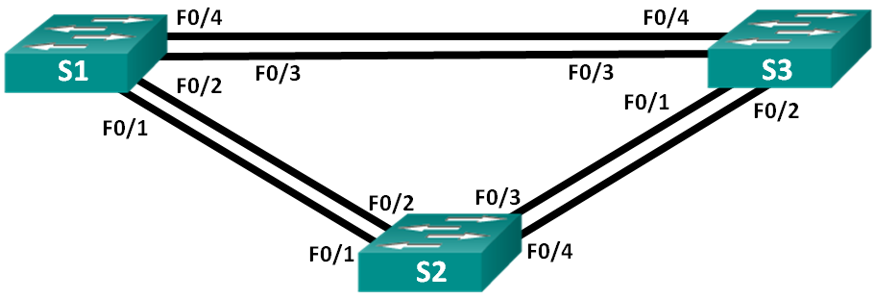
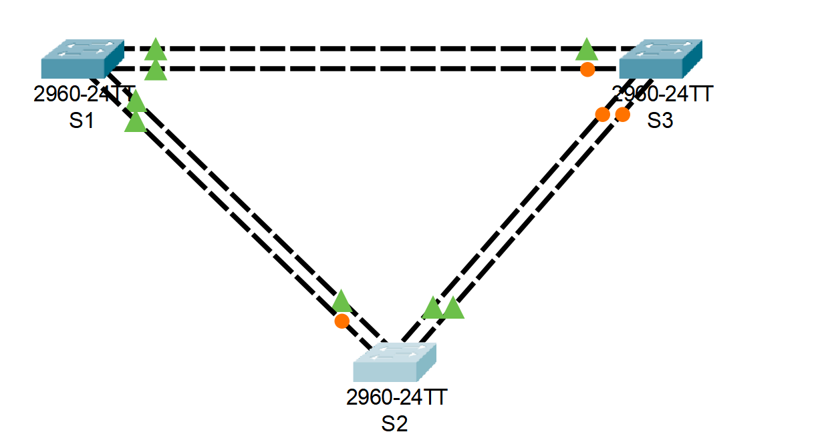
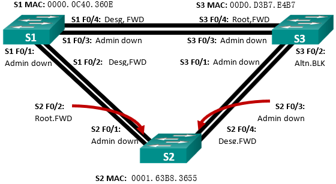

# STP.

## Задание.
1. Создание сети и настройка основных параметров устройства
2. Выбор корневого моста
3. Наблюдение за процессом выбора протоколом STP порта, исходя из стоимости портов
4. Наблюдение за процессом выбора протоколом STP порта, исходя из приоритета портов

Топология


Таблица адресации
| Устройство | Интерфейс | IP-адрес    | Маска подсети |
|------------|-----------|-------------|---------------|
| S1         | VLAN 1    | 192.168.1.1 | 255.255.255.0 |
| S2         | VLAN 1    | 192.168.1.2 | 255.255.255.0 |
| S3         | VLAN 1    | 192.168.1.3 | 255.255.255.0 |


### 1. Создание сети и настройка основных параметров устройства.

#### 1. Создать сеть согласно топологии.
Подключите устройства, как показано в топологии, и подсоедините необходимые кабели.


#### 2. Выполните инициализацию и перезагрузку коммутаторов.
```shell
Switch>en
Switch#reload
Proceed with reload? [confirm]
```
#### 3.	Настройте базовые параметры каждого коммутатора.

a.	Отключите поиск DNS.
b.	Присвойте имена устройствам в соответствии с топологией.
c.	Назначьте class в качестве зашифрованного пароля доступа к привилегированному режиму.
d.	Назначьте cisco в качестве паролей консоли и VTY и активируйте вход для консоли и VTY каналов.
e.	Настройте logging synchronous для консольного канала.
f.	Настройте баннерное сообщение дня (MOTD) для предупреждения пользователей о запрете несанкционированного доступа.
g.	Задайте IP-адрес, указанный в таблице адресации для VLAN 1 на всех коммутаторах.
h.	Скопируйте текущую конфигурацию в файл загрузочной конфигурации.


##### Команды для Switch 1
```shell
Switch>en
Switch#conf t
Switch(config)#hostname S1
S1(config)#no ip domain-lookup
S1(config)#enable secret level 15 class
S1(config)#line console 0
S1(config-line)#password cisco
S1(config-line)#logging synchronous
S1(config-line)#login
S1(config-line)#line vty 0 15
S1(config-line)#password cisco
S1(config-line)#login
S1(config)#exit
S1(config)#banner motd #Unauthorized access to this device is prohibited!#
S1(config)#interface vlan 1
S1(config-if)#ip address 192.168.1.1 255.255.255.0
S1(config-if)#exit
S1(config)#exit
S1#copy running-config startup-config 
```

##### Команды для Switch 2
```shell
Switch>en
Switch#conf t
Switch(config)#hostname S2
S2(config)#no ip domain-lookup
S2(config)#enable secret level 15 class
S2(config)#line console 0
S2(config-line)#password cisco
S2(config-line)#logging synchronous
S2(config-line)#login
S2(config-line)#line vty 0 15
S2(config-line)#password cisco
S2(config-line)#login
S2(config)#exit
S2(config)#banner motd #Unauthorized access to this device is prohibited!#
S2(config)#interface vlan 1
S2(config-if)#ip address 192.168.1.2 255.255.255.0
S2(config-if)#exit
S2(config)#exit
S2#copy running-config startup-config 
```

##### Команды для Switch 3
```shell
Switch>en
Switch#conf t
Switch(config)#hostname S3
S3(config)#no ip domain-lookup
S3(config)#enable secret level 15 class
S3(config)#line console 0
S3(config-line)#password cisco
S3(config-line)#logging synchronous
S3(config-line)#login
S3(config-line)#line vty 0 15
S3(config-line)#password cisco
S3(config-line)#login
S3(config)#exit
S3(config)#banner motd #Unauthorized access to this device is prohibited!#
S3(config)#interface vlan 1
S3(config-if)#ip address 192.168.1.3 255.255.255.0
S3(config-if)#exit
S3(config)#exit
S3#copy running-config startup-config 
```

#### 4.	Проверьте связь.
1. Проверьте способность компьютеров обмениваться эхо-запросами.
2. Успешно ли выполняется эхо-запрос от коммутатора S1 на коммутатор S2?	______________
3. Успешно ли выполняется эхо-запрос от коммутатора S1 на коммутатор S3?	______________
4. Успешно ли выполняется эхо-запрос от коммутатора S2 на коммутатор S3?	______________
5. Выполняйте отладку до тех пор, пока ответы на все вопросы не будут положительными.

##### Проверка
```shell
S1#ping 192.168.1.2

Type escape sequence to abort.
Sending 5, 100-byte ICMP Echos to 192.168.1.2, timeout is 2 seconds:
.....
Success rate is 0 percent (0/5)

S1#ping 192.168.1.3

Type escape sequence to abort.
Sending 5, 100-byte ICMP Echos to 192.168.1.3, timeout is 2 seconds:
.....
Success rate is 0 percent (0/5)

S2#ping 192.168.1.3

Type escape sequence to abort.
Sending 5, 100-byte ICMP Echos to 192.168.1.3, timeout is 2 seconds:
.....
Success rate is 0 percent (0/5)
```

Как видно из тестов IP-связность отсутствует в связи с админитсративно выключенным interface vlan 1 на всех коммутаторах. 

Включение int vlan1 на коммутаторах:
```shell
S1#conf t
Enter configuration commands, one per line.  End with CNTL/Z.
S1(config)#int vlan1
S1(config-if)#no sh
S1(config-if)#
%LINK-5-CHANGED: Interface Vlan1, changed state to up
%LINEPROTO-5-UPDOWN: Line protocol on Interface Vlan1, changed state to up

S2#conf t
Enter configuration commands, one per line.  End with CNTL/Z.
S2(config)#int vlan 1
S2(config-if)#no sh
S2(config-if)#
%LINK-5-CHANGED: Interface Vlan1, changed state to up
%LINEPROTO-5-UPDOWN: Line protocol on Interface Vlan1, changed state to up

S3#conf t
Enter configuration commands, one per line.  End with CNTL/Z.
S3(config)#int vlan
% Incomplete command.
S3(config)#int vlan 1
S3(config-if)#no sh
S3(config-if)#
%LINK-5-CHANGED: Interface Vlan1, changed state to up
%LINEPROTO-5-UPDOWN: Line protocol on Interface Vlan1, changed state to up
```

Повторный тест ip-связности прошёл успешно:
```shell
S1(config-if)#do ping 192.168.1.2
Type escape sequence to abort.
Sending 5, 100-byte ICMP Echos to 192.168.1.2, timeout is 2 seconds:
..!!!
Success rate is 60 percent (3/5), round-trip min/avg/max = 0/0/0 ms

S1(config-if)#do ping 192.168.1.3
Type escape sequence to abort.
Sending 5, 100-byte ICMP Echos to 192.168.1.3, timeout is 2 seconds:
..!!!
Success rate is 60 percent (3/5), round-trip min/avg/max = 0/0/0 ms

S2(config-if)#do ping 192.168.1.3
Type escape sequence to abort.
Sending 5, 100-byte ICMP Echos to 192.168.1.3, timeout is 2 seconds:
..!!!
Success rate is 60 percent (3/5), round-trip min/avg/max = 1/1/1 ms
```


### 2. Определение корневого моста.

Для каждого экземпляра протокола spanning-tree (коммутируемая сеть LAN или широковещательный домен) существует коммутатор, выделенный в качестве корневого моста. Корневой мост служит точкой привязки для всех расчётов протокола spanning-tree, позволяя определить избыточные пути, которые следует заблокировать.
Процесс выбора определяет, какой из коммутаторов станет корневым мостом. Коммутатор с наименьшим значением идентификатора моста (BID) становится корневым мостом. Идентификатор BID состоит из значения приоритета моста, расширенного идентификатора системы и MAC-адреса коммутатора. Значение приоритета может находиться в диапазоне от 0 до 65535 с шагом 4096. По умолчанию используется значение 32768.

#### 1.	Отключите все порты на коммутаторах.
```shell
S1#conf t
S1(config)#interface range FastEthernet 0/1 - 24
S1(config-if-range)#shutdown 
S1(config-if-range)#exit
S1(config)#interface range GigabitEthernet 0/1-2
S1(config-if-range)#shutdown 

S2#conf t
S2(config)#interface range FastEthernet 0/1 - 24
S2(config-if-range)#shutdown 
S2(config-if-range)#exit
S2(config)#interface range GigabitEthernet 0/1-2
S2(config-if-range)#shutdown 

S3#conf t
S3(config)#interface range FastEthernet 0/1 - 24
S3(config-if-range)#shutdown 
S3(config-if-range)#exit
S3(config)#interface range GigabitEthernet 0/1-2
S3(config-if-range)#shutdown 
```


#### 2. Настройте подключенные порты в качестве транковых.
```shell
S1#conf t
S1(config)#int ran fa0/1-fa0/4
S1(config-if-range)#switchport mode trunk

S2#conf t
S2(config)#int ran fa0/1-fa0/4
S2(config-if-range)#switchport mode trunk

S3#conf t
S3(config)#int ran fa0/1-fa0/4
S3(config-if-range)#switchport mode trunk
```

#### 3. Включите порты F0/2 и F0/4 на всех коммутаторах.
```shell
S1#conf t
S1(config)#int range fa0/2, fa0/4
S1(config-if-range)#no sh

S2#conf t
S2(config)#int range fa0/2, fa0/4
S2(config-if-range)#no sh

S3#conf t
S3(config)#int range fa0/2, fa0/4
S3(config-if-range)#no sh
```

#### 4. Отобразите данные протокола spanning-tree.

Введите команду **show spanning-tree** на всех трех коммутаторах. Приоритет идентификатора моста рассчитывается путем сложения значений приоритета и расширенного идентификатора системы. Расширенным идентификатором системы всегда является номер сети VLAN. В примере ниже все три коммутатора имеют равные значения приоритета идентификатора моста (32769 = 32768 + 1, где приоритет по умолчанию = 32768, номер сети VLAN = 1); следовательно, коммутатор с самым низким значением MAC-адреса становится корневым мостом.
```shell
S1#sh spanning-tree 
VLAN0001
  Spanning tree enabled protocol ieee
  Root ID    Priority    32769
             Address     0000.0C40.360E
             This bridge is the root
             Hello Time  2 sec  Max Age 20 sec  Forward Delay 15 sec

  Bridge ID  Priority    32769  (priority 32768 sys-id-ext 1)
             Address     0000.0C40.360E
             Hello Time  2 sec  Max Age 20 sec  Forward Delay 15 sec
             Aging Time  20

Interface        Role Sts Cost      Prio.Nbr Type
---------------- ---- --- --------- -------- --------------------------------
Fa0/2            Desg FWD 19        128.2    P2p
Fa0/4            Desg FWD 19        128.4    P2p


S2#sh spanning-tree 
VLAN0001
  Spanning tree enabled protocol ieee
  Root ID    Priority    32769
             Address     0000.0C40.360E
             Cost        19
             Port        2(FastEthernet0/2)
             Hello Time  2 sec  Max Age 20 sec  Forward Delay 15 sec

  Bridge ID  Priority    32769  (priority 32768 sys-id-ext 1)
             Address     0001.63B8.3655
             Hello Time  2 sec  Max Age 20 sec  Forward Delay 15 sec
             Aging Time  20

Interface        Role Sts Cost      Prio.Nbr Type
---------------- ---- --- --------- -------- --------------------------------
Fa0/2            Root FWD 19        128.2    P2p
Fa0/4            Desg FWD 19        128.4    P2p


S3#sh spanning-tree 
VLAN0001
  Spanning tree enabled protocol ieee
  Root ID    Priority    32769
             Address     0000.0C40.360E
             Cost        19
             Port        4(FastEthernet0/4)
             Hello Time  2 sec  Max Age 20 sec  Forward Delay 15 sec

  Bridge ID  Priority    32769  (priority 32768 sys-id-ext 1)
             Address     00D0.D3B7.E4B7
             Hello Time  2 sec  Max Age 20 sec  Forward Delay 15 sec
             Aging Time  20

Interface        Role Sts Cost      Prio.Nbr Type
---------------- ---- --- --------- -------- --------------------------------
Fa0/4            Root FWD 19        128.4    P2p
Fa0/2            Altn BLK 19        128.2    P2p
```

На схеме ниже отображены роль (Role) и состояние (Sts) активных портов на каждом коммутаторе в топологии.




С учетом выходных данных, поступающих с коммутаторов, ответьте на следующие вопросы.

- Какой коммутатор является корневым мостом? 
Коммутатор S1 является Root Bridge.

- Почему этот коммутатор был выбран протоколом spanning-tree в качестве корневого моста?
В связи с самым низким значением MAC-адреса.

- Какие порты на коммутаторе являются корневыми портами?
На коммутаторе S1 корневых портов нет.
На коммутаторе S2 корневой порт Fa0/2.
на коммутаторе S3 корневой порт Fa0/4.

- Какие порты на коммутаторе являются назначенными портами?
На коммутаторе S1 назначенные порты F0/2, Fa0/4.
На коммутаторе S2 назначенный порт Fa0/4.
На коммутаторе S3 назначенных портов нет.

- Какой порт отображается в качестве альтернативного и в настоящее время заблокирован? 
На коммутаторе S1 альтернативных, заблокированных портов нет.
На коммутаторе S2 альтернативных, заблокированных портов нет.
На коммутаторе S3 альтернативный, заблокированный порт Fa0/2.

- Почему протокол spanning-tree выбрал этот порт в качестве невыделенного (заблокированного) порта?
Стоимость пути до Root Bridge с портов Fa0/2 коммутатора S3 и Fa0/4 коммутатора S2 больше чем у остальных активных портов и составляет 38(19+19), поэтому выбор происходил между этими двумя портами. Так как коммутатор S2 имеет такой же BID как и коммутатор S3, но мак-адрес у него ниже, соответственно порт Fa0/4(в сторону S3) у него будет Designated, в связи с этим, на S3 по правилам протокола порт должен быть в Alternate Blocking.

Выбор на каком коммутатоторе заблокировать порт происходит по следующей схеме:
1. Меньшего Root Path Cost.
2. Меньшего Bridge ID.
3. Меньшего Port ID.

### 3. Наблюдение за процессом выбора протоколом STP порта, исходя из стоимости портов

Алгоритм протокола spanning-tree (STA) использует корневой мост как точку привязки, после чего определяет, какие порты будут заблокированы, исходя из стоимости пути. Порт с более низкой стоимостью пути является предпочтительным. Если стоимости портов равны, процесс сравнивает BID. Если BID равны, для определения корневого моста используются приоритеты портов. Наиболее низкие значения являются предпочтительными. В части 3 вам предстоит изменить стоимость порта, чтобы определить, какой порт будет заблокирован протоколом spanning-tree.

#### 1. Определите коммутатор с заблокированным портом. 

При текущей конфигурации только один коммутатор может содержать заблокированный протоколом STP порт. Выполните команду show spanning-tree на обоих коммутаторах некорневого моста. В примере ниже протокол spanning-tree блокирует порт Fa0/2 на коммутаторе с самым высоким идентификатором BID (S3).
```shell
S2#show spanning-tree 
VLAN0001
  Spanning tree enabled protocol ieee
  Root ID    Priority    32769
             Address     0000.0C40.360E
             Cost        19
             Port        2(FastEthernet0/2)
             Hello Time  2 sec  Max Age 20 sec  Forward Delay 15 sec

  Bridge ID  Priority    32769  (priority 32768 sys-id-ext 1)
             Address     **0001.63B8.3655**
             Hello Time  2 sec  Max Age 20 sec  Forward Delay 15 sec
             Aging Time  20

Interface        Role Sts Cost      Prio.Nbr Type
---------------- ---- --- --------- -------- --------------------------------
Fa0/2            Root FWD 19        128.2    P2p
**Fa0/4            Desg** FWD 19        128.4    P2p


S3#show spanning-tree 
VLAN0001
  Spanning tree enabled protocol ieee
  Root ID    Priority    32769
             Address     0000.0C40.360E
             Cost        19
             Port        4(FastEthernet0/4)
             Hello Time  2 sec  Max Age 20 sec  Forward Delay 15 sec

  Bridge ID  Priority    32769  (priority 32768 sys-id-ext 1)
             Address     **00D0.D3B7.E4B7**
             Hello Time  2 sec  Max Age 20 sec  Forward Delay 15 sec
             Aging Time  20

Interface        Role Sts Cost      Prio.Nbr Type
---------------- ---- --- --------- -------- --------------------------------
**Fa0/2            Altn** BLK 19        128.2    P2p
Fa0/4            Root FWD 19        128.4    P2p
```
#### 2. Измените стоимость порта. 
```shell
S3#conf t
S3(config)#interface Fa0/4
S3(config-if)#spanning-tree cost 18
```
#### 3. Просмотрите изменения протокола spanning-tree. 
```shell
S3#show spanning-tree 
VLAN0001
  Spanning tree enabled protocol ieee
  Root ID    Priority    32769
             Address     0000.0C40.360E
             Cost        18
             Port        4(FastEthernet0/4)
             Hello Time  2 sec  Max Age 20 sec  Forward Delay 15 sec

  Bridge ID  Priority    32769  (priority 32768 sys-id-ext 1)
             Address     00D0.D3B7.E4B7
             Hello Time  2 sec  Max Age 20 sec  Forward Delay 15 sec
             Aging Time  20

Interface        Role Sts Cost      Prio.Nbr Type
---------------- ---- --- --------- -------- --------------------------------
Fa0/2            Desg LSN 19        128.2    P2p
Fa0/4            Root FWD 18        128.4    P2p

S2#show spanning-tree 
VLAN0001
  Spanning tree enabled protocol ieee
  Root ID    Priority    32769
             Address     0000.0C40.360E
             Cost        19
             Port        2(FastEthernet0/2)
             Hello Time  2 sec  Max Age 20 sec  Forward Delay 15 sec

  Bridge ID  Priority    32769  (priority 32768 sys-id-ext 1)
             Address     0001.63B8.3655
             Hello Time  2 sec  Max Age 20 sec  Forward Delay 15 sec
             Aging Time  20

Interface        Role Sts Cost      Prio.Nbr Type
---------------- ---- --- --------- -------- --------------------------------
Fa0/2            Root FWD 19        128.2    P2p
**Fa0/4            Altn BLK** 19        128.4    P2p
```

