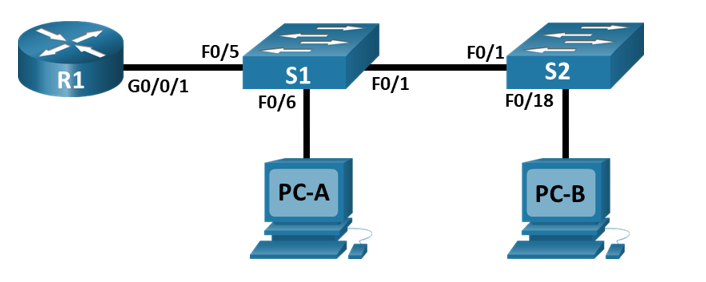

# VLAN

## Задание.
1. Построение сети и настройка основных параметров устройства
2. Создание VLAN и назначение портов коммутаторов
3. Настройка Trunk между коммутаторами
4. Настройка маршрутизации между VLAN на маршрутизаторе
5. Проверка работы настроенной схемы


### 1. Построение сети и настройка основных параметров устройства.

#### 1. Построить топологию согласно схеме сети.


1. Таблица IP-адресов:

| Device | Interface | IP Address   | Subnet Mask   | Default Gateway |
| ------ | --------- | ------------ | ------------- | --------------- |
| R1     | G0/0/1.3  | 192.168.3.1  | 255.255.255.0 | N/A             |
| R1     | G0/0/1.4  | 192.168.4.1  | 255.255.255.0 | N/A             |
| R1     | G0/0/1.8  | N/A          | N/A           | N/A             |
| S1     | VLAN 3    | 192.168.3.11 | 255.255.255.0 | 192.168.3.1     |
| S2     | VLAN 3    | 192.168.3.12 | 255.255.255.0 | 192.168.3.1     |
| PC-A   | NIC       | 192.168.3.3  | 255.255.255.0 | 192.168.3.1     |
| PC-B   | NIC       | 192.168.4.3  | 255.255.255.0 | 192.168.4.1     |

2. Таблица VLAN:

| VLAN | Name       | Interface Assigned                                         |
| ---- | ---------- | ---------------------------------------------------------- |
| 3    | Management | S1: VLAN 3                                                 |
|      |            | S2: VLAN 3                                                 |
|      |            | S1: F0/6                                                   |
| ---- | ---------- | ---------------------------------------------------------- |
| 4    | Operations | S2: F0/18                                                  |
| ---- | ---------- | ---------------------------------------------------------- |
| 7    | ParkingLot | S1: F0/2-4, F0/7-24, G0/1-2                                |
|      |            | S2: F0/2-17, F0/19-24, G0/1-2                              |
| ---- | ---------- | ---------------------------------------------------------- |                      
| 8    | Native     | N/A                                                        |


#### 2. Настроить базовую конфигурацию на маршрутизаторе.
a. Подключитесь к маршрутизатору с помощью консоли и включите привилегированный режим EXEC.
b. Войдите в режим конфигурации.
c. Назначьте маршрутизатору имя устройства.
d. Отключите поиск DNS, чтобы маршрутизатор не пытался преобразовать неправильно введенные команды, как будто это имена хостов.
e. Назначьте class в качестве зашифрованного пароля привилегированного режима EXEC.
f. Назначьте cisco в качестве пароля консоли и включите вход.
g. Назначьте cisco в качестве пароля VTY и включите вход.
h. Зашифруйте пароли в виде открытого текста.
i. Создайте баннер, предупреждающий любого, кто получает доступ к устройству, о том, что несанкционированный доступ запрещен.
j. Сохраните текущую конфигурацию в файле конфигурации запуска.
k. Установите часы на маршрутизаторе.

##### Команды для настройки маршрутизатора

```shell
Router(config)#hostname R1
R1(config)#no ip domain-lookup
R1(config)#enable secret level 15 class
R1(config-line)#line console 0
R1(config-line)#password cisco
R1(config-line)#login
R1(config)#line vty 0 15
R1(config-line)#password cisco
R1(config-line)#login
R1(config)#banner motd #Unauthorized access to this device is prohibited!#
R1#copy running-config startup-config 
R1#clock set 22:44:00  oct 13 2024
```

#### 3. Настроить базовую конфигурацию на коммутаторах.

a. Подключитесь к коммутатору с помощью консоли и включите привилегированный режим EXEC.
b. Войдите в режим конфигурации.
c. Назначьте коммутатору имя устройства.
d. Отключите поиск DNS, чтобы маршрутизатор не пытался преобразовать неправильно введенные команды в имена хостов.
e. Назначьте class в качестве зашифрованного пароля привилегированного режима EXEC.
f. Назначьте cisco в качестве пароля консоли и включите вход.
g. Назначьте cisco в качестве пароля vty и включите вход.
h. Зашифруйте пароли в виде открытого текста.
i. Создайте баннер, предупреждающий любого, кто получает доступ к устройству, о том, что несанкционированный доступ запрещен.
j. Установите часы на коммутаторе.
Примечание: используйте вопросительный знак (?), чтобы помочь с правильной последовательностью параметров, необходимых для выполнения этой команды.
k. Скопируйте текущую конфигурацию в конфигурацию запуска.

##### Команды для Switch 1

```shell

conf t
hostname S1
no ip domain-lookup
enable secret level 15 class
line console 0
password cisco
login
exit
line vty 0 15
password cisco
login
exit
service password-encryption 
banner motd #Unauthorized access to this device is prohibited!#
exit                 
clock set 14:10:30 oct 14 2024
copy running-config startup-config 

```

##### Команды для Switch 2

```shell

conf t
hostname S2
no ip domain-lookup
enable secret level 15 class
line console 0
password cisco
login
exit
line vty 0 15
password cisco
login
exit
service password-encryption 
banner motd #Unauthorized access to this device is prohibited!#
exit                 
clock set 14:15:00 oct 14 2024
copy running-config startup-config 

```

####  Настйрока ПК.
Настройка производится согласно таблице IP-адресов.

| Device | Interface | IP Address   | Subnet Mask   | Default Gateway |
| ------ | --------- | ------------ | ------------- | --------------- |
| PC-A   | NIC       | 192.168.3.3  | 255.255.255.0 | 192.168.3.1     |
| PC-B   | NIC       | 192.168.4.3  | 255.255.255.0 | 192.168.4.1     |


### 2. Создание VLAN и назначение портов коммутаторов.

#### 1. Создание VLAN на обоих коммутаторах.

a. Создайте и назовите требуемые VLAN на каждом коммутаторе из таблицы выше.
b. Настройте интерфейс управления и шлюз по умолчанию на каждом коммутаторе, используя информацию об IP-адресе в таблице адресации.
c. Назначьте все неиспользуемые порты на обоих коммутаторах VLAN ParkingLot, настройте их для режима статического доступа и административно деактивируйте их.

##### Пример настройки:

```shell
S1#conf t
S1(config)#vlan 3
S1(config-vlan)#name Management

S1(config)#interface Vlan3
S1(config-if)#ip address 192.168.3.11 255.255.255.0

S1(config) ip default-gateway 192.168.3.1

S1(config)#interface range fastEthernet0/2-4
S1(config-if-range)#description ParkingLot
S1(config-if-range)#shutdown
```


#### 1. Назначение VLAN указанным портам в таблице выше

##### Пример настройки:
